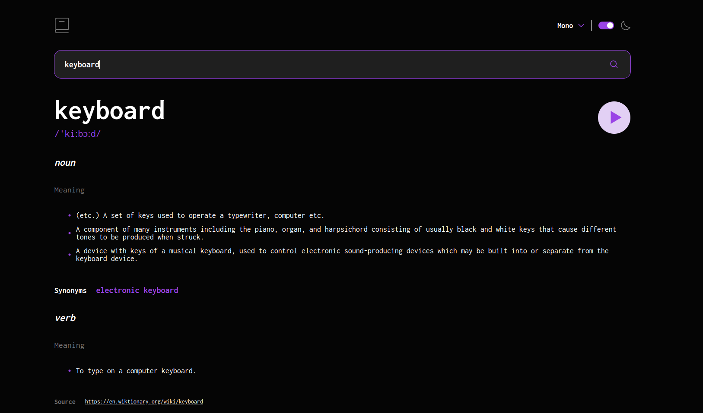

# Dictionary Web App

It is a reponsive dictionary web application, built with React, Typescript and CSS

## Demonstration link

Access this web app at: [vercel.app](https://dictionary-web-81lnfg4rp-gustavomiguel1997.vercel.app/)

## Screenshot

## Instalation and Setup

Clone down this repository. You will need `node` and `yarn` installed on your machine.

Installation:

`yarn install`

To Start Server:

`yarn dev`

To build:

`yarn build`

To Visit App:

`http://localhost:9000/`

## Approach

### Components

I separated some UI parts in small components with specific responsabities, most part of the components are simple

### CSS

I used the BEM naming style for my css class names

### Theme

For color and font theme control, I used html data attribute, such as `data-theme` and `data-font`, and the way I manage this was by creating a [custom hook](src/hooks/useTheme.ts).
It allows me to easily change the page theme just by modifying the color tokens `data-theme` without using any external libs. And along with that I used `localStorage` to save the information whenever there was a theme change
